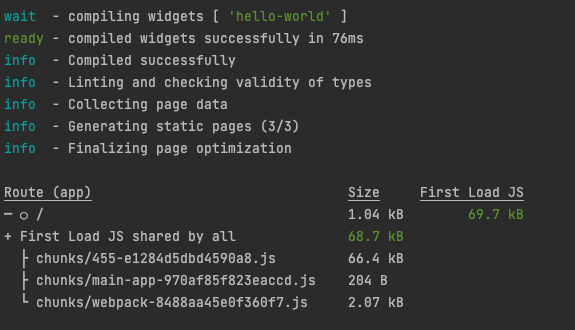

This is a Next.js application set up to build embeddable widgets 
(Web Components) for use in other applications. 
It uses default Next.js Webpack configuration, but adds a custom Webpack plugin to generate the Web Components.
The build process is integrated with Next.js builds, so you can run `npm run build` to build both Next.js app and Web Components. 
`npm run dev` is also supported.

I tested it with the Next.js version 13.2.4, but it should work with any version 12 or higher.

## How to use
To see how it works, just clone the repo and run `npm install` and `npm run dev`. 
Then open http://localhost:3000 in your browser.

## How it works
The idea is taken from [LeMisterV comment in a GitHub thread](https://github.com/vercel/next.js/discussions/15989#discussioncomment-2639901). The plugin is located in `webpack-config/widget-compiler` module. 
The main idea is to take the Webpack configuration specified in `webpack.config.js`
and attach a separate compiler process to `beforeCompile` hook. This way, the components
are rebuilt every time the Next.js app is rebuilt. Additionally, I use `WatchExternalFilesPlugin`
to watch for changes in the widgets directory and rebuild the components when they change.
